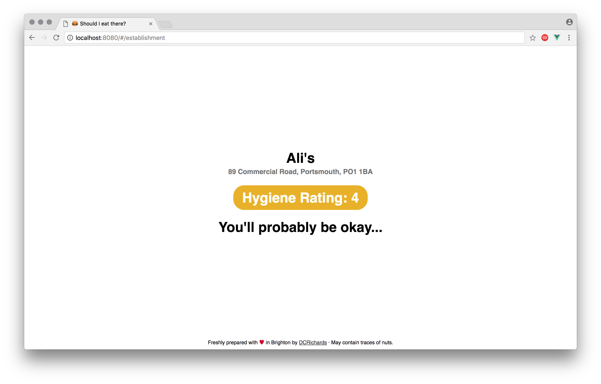

# [shouldieatthere.co.uk](http://shouldieatthere.co.uk/)

🍽 Check the food hygiene rating of your favourite establishments. 

## About this project

This project was written as an exploration of [vue.js](https://vuejs.org/) 2.x. It uses the standard [Webpack template](https://github.com/vuejs-templates/webpack) and also makes use of:

* [Axios](https://github.com/mzabriskie/axios) for HTTP requests.
* [Vuex](https://vuex.vuejs.org/en/getting-started.html) for state management (store).
* [Babel](https://babeljs.io/docs/setup/) for ES2015+ JavaScript support.

## Getting set up for development

This project uses [Docker](https://docker.com/) for development. Simply run:

```bash
docker-compose up --build
```
## Go take a look

It's live over at [shouldieatthere.co.uk](http://shouldieatthere.co.uk/)!




